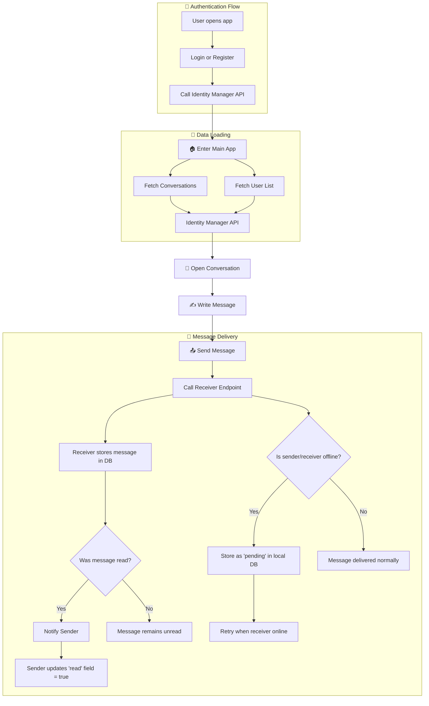

<div style="text-align:center">
  
  <div style="font-size:36px; font-weight:bold; margin-top:4px;">Telegraph</div>
</div>

<hr>
<br>

This is a peer-to-peer messaging application created using `python` combined with `streamlit` for the web UI. There are two entities which are the identity manager and the client(s).

The identity manager is the one who manage every account information, such as:

- username
- password encrypted
- hostname and port
- status
- last time seen online

The clients can communicate with each other without a centralized server. Each client can do the following actions:

- send messages
- receive messages
- notify that a message has been read
- retry sending pending messages to offline users

Messages are saved with the format:
```json
{
  "from": "Joel", // user who sent the message
  "to": "Claudia", // user who received the message
  "text": "Hello World!", // text of the message
  "timestamp":"2025-10-03T21:43:00-04:00", // time the message was sent
  "read": true, // whether or not the message was read
  "status": "ok" // ok: sent correctly, pending: failed when sent
}
```

The schema below presents the structure of message handling and user login procedures:



## Only for Developers
This section describes all the instructions to be followed for executing 
the app correctly.

### Create python virtual environment
```bash
python3 -m venv venv
```

### Activate python virtual environment
```bash
source ./venv/bin/activate
```

### Update requirements.txt
```bash
pip freeze > requirements.txt
```

### Run the application

1. Build Images
```bash
# identity-manager
docker build -t src-identity-manager:latest ./identity-manager

# client
docker build -t src-client:latest ./client
```

2. Create a network
```bash
docker network create <network_name>
```

or if you are using swarm:
```bash
docker network create <network_name> --driver overlay --attachable
```

3. Run Identity Manager Container
```bash
docker run --rm \
  --name identity-manager \
  --network <network_name> \
  -v $(pwd)/identity-manager/app:/app \
  -v $(pwd)/volumes/identity-data:/data \
  -p 8100:8000 \
  src-identity-manager:latest
```

4. Create as many clients as you need
```bash
docker run --rm \
  --name <client_name> \
  --network <network_name> \
  -v $(pwd)/client/app:/app \
  -v $(pwd)/volumes/<client_name>-data:/data \
  -p <port_on_host>:5000 \
  -p <port_on_host>:8000 \
  -e PORT=5000 \
  -e API_PORT=8000 \
  src-client:latest
```

5. Remove containers (optional)
```bash
docker rm -f <container_name>
```

### Create connection using Swarm

1. Initialize Swarm
```bash
docker swarm init --advertise-addr <IP_ADDR>
```

2. Get manager token
```bash
docker swarm join-token manager
```

3. Copy the command given and paste it in the other computer
